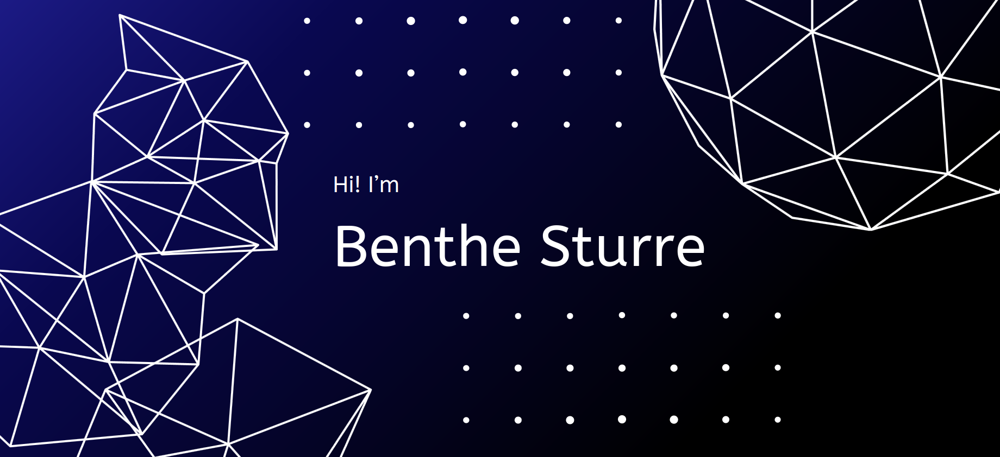

###  Hello there !

### 👨🏻‍💻 &nbsp;About Me

💡 &nbsp; I am a MS in Astrophysics student at Lund University, Sweden.\
💻 &nbsp; I'm currently performing research in the field galactic dynamics. \
🎓&nbsp; I graduated from Leiden University (BSc in Astronomy and BSc in Mathematics, 2025).\
🌱 &nbsp; I'm on track for learning more about Artificial Intelligence and Machine Learning.\
✍️ &nbsp; In my free time, I run, do astrophotography and play games as my hobbies.\
💬 &nbsp; Feel free to reach out to me!\
✉️ &nbsp; You can email me at benthesturre@gmail.com. I'll try to respond as soon as possible!\
📄 &nbsp; You can check my [LinkedIn](https://www.linkedin.com/in/benthe-sturre/) for more details about work experience.

### 🛠 &nbsp;Tech Stack

&nbsp;
&nbsp;
&nbsp;
&nbsp;
&nbsp;
&nbsp;
&nbsp;
&nbsp;
&nbsp;
&nbsp;
&nbsp;
&nbsp;
&nbsp;
&nbsp;

### 📫 &nbsp; How to reach me:
 &nbsp;
 &nbsp;
